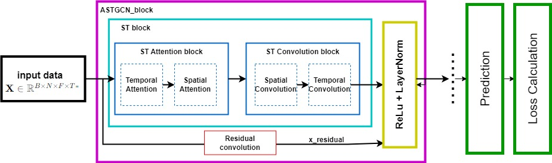

# ASTGCN

Attention Based Spatial-Temporal Graph Convolutional Networks for Traffic Flow Forecasting (ASTGCN)



# Requirement
  '''
  numpy==1.26.4
  torch==2.3.1
  scipy==1.14.0
  matplotlib==3.9.0
  networkx==3.3
  pandas==2.2.2
  tensorflow==2.16.2
  tensorboardX==2.6.2.2
  scikit-learn==1.5.1
  '''

# Reference

```latex
@inproceedings{guo2019attention,
  title={Attention based spatial-temporal graph convolutional networks for traffic flow forecasting},
  author={Guo, Shengnan and Lin, Youfang and Feng, Ning and Song, Chao and Wan, Huaiyu},
  booktitle={Proceedings of the AAAI Conference on Artificial Intelligence},
  volume={33},
  pages={922--929},
  year={2019}
}
```

# Configuration

Step 1: The loss function and metrics can be set in the configuration file in ./configurations

Step 2: The last three lines of the configuration file are as follows:

  ```c++
  loss_function = masked_mae
  metric_method = mask
  missing_value = 0.0
  ```

loss_function can choose 'masked_mae',  'masked_mse',  'mae',  'mse'. The loss function with a mask does not consider  missing values.

metric_method can choose 'mask', 'unmask'. The metric with a mask does not evaluate missing values.

The missing_value is the missing identification, whose default value is 0.0

# Datasets

Step 1: Download PEMS04 and PEMS08 datasets provided by [ASTGNN](https://github.com/guoshnBJTU/ASTGNN/tree/main/data). 

Step 2: Process dataset

- on PEMS04 dataset

  ```shell
  python prepareData.py --config configurations/PEMS04_astgcn.conf
  ```

- on PEMS08 dataset

  ```shell
  python prepareData.py --config configurations/PEMS08_astgcn.conf
  ```


# Train and Test

run 
'''shell
python GUI.py
'''
in the GUI, the proces is in sequence
Step 1: Choose the dataset available
Step 2: Choose to use CPU or GPU for the training process
Step 3: Prepare data
Step 4(wont be available to do if prepare data has not been complete): Train the Model
At anytime in training user can press the Stop Training button to force stop the process

  

  


